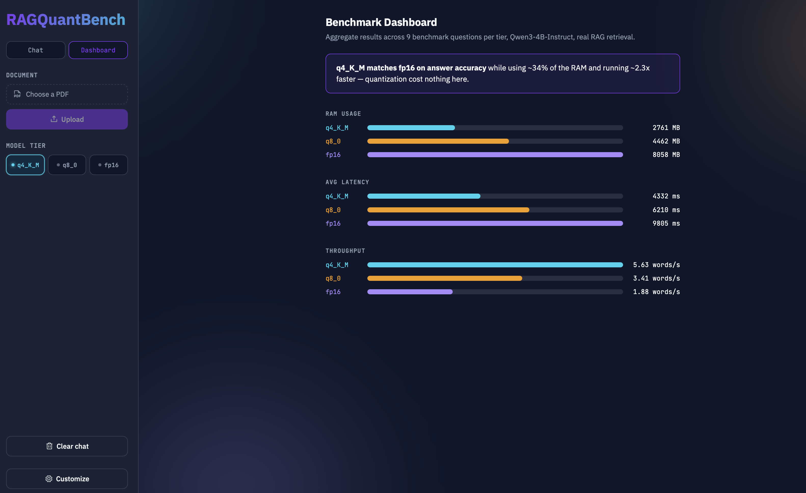
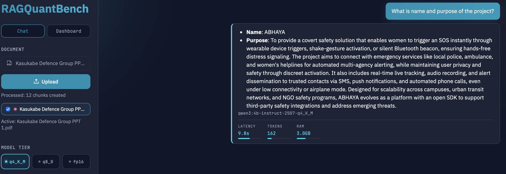
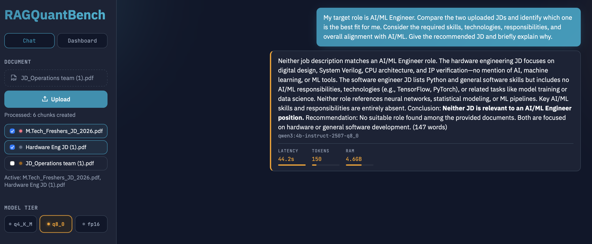

# RAGQuantBench

A benchmarking tool that measures how LLM quantization — fp16 vs. 8-bit vs. 4-bit — affects RAM usage, latency, and answer quality. Instead of synthetic benchmarks, it uses a real RAG pipeline over uploaded PDFs as the test harness: same documents, same questions, same retrieval, only the model's weight precision changes between runs. The PDF chat interface you can click around in is the vehicle for generating that comparison, not the product itself.

## Screenshots

### Benchmark Dashboard



### RAG Chat Interface



### Multi-Document RAG



## The question this answers

Does compressing a model's weights actually hurt answer quality, or is it free performance?

## Key finding

**q4_K_M matched fp16 on accuracy across every tested question, while using ~34% of the RAM and running 1.9–2.3x faster.** Across repeated benchmark runs (9 questions, real RAG retrieval, Qwen3-4B-Instruct):

| Variant | Avg RAM | Avg Latency | Relative to fp16 |
|---|---|---|---|
| `q4_K_M` | 2761 MB (2.7 GB) | 4332 ms | 34% RAM · 2.26x faster |
| `q8_0` | 4462 MB (4.4 GB) | 6210 ms | 55% RAM · 1.58x faster |
| `fp16` | 8058 MB (8.1 GB) | 9805 ms | baseline |

On every question in the final run — including a "list every chemical compound mentioned" enumeration question that's a good stress test for precision — all three variants produced the identical, correct answer (`CO2, H2O, C6H12O6, O2`). Quantizing to 4-bit cost nothing on correctness here.

**One thing we did catch along the way**: in an earlier pass (direct-context, before we tightened the prompt), `q8_0` visibly second-guessed itself on that same enumeration question — it over-included non-compounds (`stroma`, `thylakoids`) before self-correcting mid-answer, and its latency spiked to 16.6s (vs. 8.5s for q4_K_M and 22.4s for fp16 on that same call — fp16 was actually the cleanest on that particular pass). That instability wasn't quantization-specific; it went away for all three variants once the prompt explicitly forbade self-correction and re-deriving. Worth knowing if you're benchmarking your own prompts: some of what looks like a "quantization tax" is actually a prompt-engineering gap.

## Architecture

```
PDF upload
    │
    ▼
Text extraction (pypdf, layout-aware)
    │
    ▼
Chunking (~200 tokens, 40-token overlap)
    │
    ▼
Embedding (all-MiniLM-L6-v2, 384-dim) ──► pgvector storage (Postgres)
                                                    │
User question ──► Query classification   ───────────┤
                   (SUMMARY vs. SPECIFIC,           │
                    lightweight LLM call)           │
                        │                           │
          ┌─────────────┴─────────────┐             │
          ▼                           ▼             │
   SPECIFIC: top-k          SUMMARY: fetch all      │
   similarity retrieval     chunks, map-reduce      │
   (cosine distance)        (per-chunk abstract     │
          │                 + synthesized reduce)   │
          │                           │             │
          └─────────────┬─────────────┘             │
                         ▼                          │
              Ollama inference ◄────────────────────┘
           (user-selected quantization tier:
            q4_K_M / q8_0 / fp16)
                         │
                         ▼
                      Answer
```

Retrieval is scoped per-document — every query filters on `document_id`, so uploading a second PDF doesn't bleed into the first document's answers.

## Tech stack

- **Ollama** — Qwen3 4B Instruct, three quantization tags: `q4_K_M`, `q8_0`, `fp16`
- **FastAPI** — backend, `/ingest`, `/chat`, `/retrieve` endpoints
- **PostgreSQL + pgvector** — combined relational + vector store
- **sentence-transformers** — `all-MiniLM-L6-v2` for embeddings
- **React + Vite** — frontend chat UI
- **Docker Compose** — orchestrates app, db, and frontend containers

## Features

- **Real-time model switching** between quantization tiers, mid-conversation, no restart
- **RAG over uploaded PDFs** with per-document scoping (multiple documents don't cross-contaminate retrieval)
- **Adaptive answer length** via `/short` and `/detail` (or `/detailed`, `/long`) slash commands typed directly into the question
- **Automatic broad-vs-specific query classification** — a lightweight LLM call decides whether a question wants a narrow fact (top-k retrieval) or a whole-document overview (map-reduce summarization across every chunk), with no keyword heuristics involved

## Why pgvector over a dedicated vector DB

- One database for both relational data (documents, chunk metadata) and vector data (embeddings) — no second system to run, back up, or keep in sync
- Per-document scoping is a plain SQL `WHERE document_id = %s` filter alongside the vector similarity `ORDER BY`, not a separate metadata-filtering API
- Zero extra infrastructure for a project this size — Postgres was already the natural choice for document/chunk bookkeeping, and pgvector just adds a column type and an operator
- A dedicated vector DB (Pinecone, Weaviate, Qdrant) earns its keep at a scale — millions of vectors, approximate-index tuning, distributed retrieval — this project is nowhere near

## Known limitations

- **Summarization can run long on dense documents.** The map-reduce summary path synthesizes per-chunk abstracts into a final overview, and getting that to consistently land in a target word range took several rounds of tuning (fixed-tier token budgets, explicit "aim for 300–500 words, don't just list everything" instructions). A document with unusually dense, tabular content can still produce a longer-than-intended summary.
- **Retrieval is pure semantic similarity — no hybrid/keyword boost.** A hybrid keyword-boost path (regex-matching literal identifiers like "day 7" and forcing that chunk into the retrieved set) was built and verified to fix exactly this class of failure, then deliberately reverted to keep retrieval simple and predictable. The tradeoff: very literal queries — exact section numbers, specific headings — can occasionally underperform pure embedding similarity when the literal match and the semantic match disagree.
- **Per-chunk summarization is extractive, not abstractive, on dense reference material.** On text-dense documents (papers, spec sheets) the per-chunk step tends to lift phrases close to the source rather than genuinely paraphrasing, so the final synthesized summary can come out more verbose and less distilled than it does on prose-heavy documents.
- **Multi-document mode is lightly tested.** Two active documents with clearly distinct content is the tested path; documents with no topical overlap at all, or three-plus documents active simultaneously, haven't been exhaustively exercised.
- **Source-attribution chips depend on the model echoing an exact tag.** The UI renders a colored citation chip only when the model's answer contains the literal `[Source: filename]` format it was instructed to use; testing showed the model sometimes cites a document in plain prose instead (e.g. "the document report.pdf") in which case it just reads as normal text, not a chip.
- **Document identity colors repeat past four documents.** Each active document gets a color from a fixed 4-color palette, assigned by `document_id % 4` — with five or more documents active at once, two of them will share a color.
- **The Benchmark Dashboard shows the historical benchmark run, not live session data.** Its numbers come from the same `results_rag_v2.json` the README's Key Finding table is built from, not from questions asked in your current session — it won't update as you chat.

## How to run it locally

**1. Clone and start the stack**

```bash
git clone https://github.com/HarshEvolves/RAGQuantBench.git
cd RAGQuantBench
docker compose up -d --build
```

This starts three containers: `app` (FastAPI, port 8001), `db` (Postgres + pgvector, port 5433), `frontend` (Vite dev server, port 5173).

**2. Pull the three model variants** (Ollama must be installed natively on the host — not in Docker — so it can use your GPU/CPU directly)

```bash
ollama pull qwen3:4b-instruct-2507-q4_K_M
ollama pull qwen3:4b-instruct-2507-q8_0
ollama pull qwen3:4b-instruct-2507-fp16
```

**3. Open the app**

```
http://localhost:5173
```

Upload a PDF, pick a model from the dropdown, and ask a question.

**4. Or drive it via curl**

```bash
curl -X POST http://localhost:8001/ingest \
  -F "file=@/path/to/your/document.pdf"

curl -X POST http://localhost:8001/chat \
  -H "Content-Type: application/json" \
  -d '{"question": "/detail what does this document cover?", "model_variant": "qwen3:4b-instruct-2507-q4_K_M", "document_id": 1}'
```

**5. Run the benchmark yourself**

```bash
python3 bench.py
```

Sweeps all three model variants across a fixed question set and writes RAM/latency/answer results to `results_rag_v2.json`.

## What I'd build next

- **Hybrid retrieval** — bring back the keyword-boost path (with proper tuning this time) so literal queries don't lose to pure semantic similarity
- **Abstractive summarization tuning** — the map-reduce summary path works but took a lot of iteration to bound; a cleaner approach (e.g., a single well-tuned prompt instead of fixed per-tier token budgets) is worth exploring

## v2: Multi-Document Comparison

v1 scoped every query to a single `document_id`. v2 adds the ability to activate several documents at once and treats them as distinct, attributable sources instead of one merged blob of context.

- **Multiple active documents.** Upload as many PDFs as you want — each upload adds to a list rather than replacing the previous document. Checkboxes in the sidebar mark which uploaded documents are "active" for the current question; the most recently uploaded document is active by default until you touch a checkbox yourself.
- **Retrieval runs separately per active document.** With N active documents, top-k similarity search runs once per document rather than once over a merged set. This guarantees every active document contributes chunks to the context regardless of how its embedding scores compare to the others' — a strong match in one document no longer crowds out a weaker-scoring but still relevant match in another.
- **Source-tagged chunks and citation-aware prompting.** Every retrieved chunk is prefixed with `[Source: {filename}]` before it reaches the model, and when more than one document is active, the prompt explicitly instructs the model to be precise about which document each fact comes from — addressing each relevant document when the question asks to compare or contrast, and saying so plainly if only one of the active documents actually has relevant content, rather than forcing a comparison that isn't there.
- **q4_K_M as the default model for multi-document mode.** The model selector auto-switches to `q4_K_M` whenever more than one document is active (unless you've manually picked a different variant), on the strength of this project's own v1 finding: `q4_K_M` already matched fp16 on accuracy while running over 2x faster, so there's no quality tradeoff being made to prioritize speed on the heavier multi-document workload.
- **Summary questions use top-k retrieval instead of map-reduce in multi-document mode.** The SUMMARY-vs-SPECIFIC classifier still runs, but a broad "what's in these documents" question, when multiple documents are active, is answered from top-k retrieval (capped per document) rather than v1's full per-chunk map-reduce summarization. This was a real fix, not a preemptive one: profiling a genuine multi-document summary request showed map-reduce taking 50+ seconds, because it was generating a mini-summary for every chunk of every active document before the final reduce pass — a cost that only gets worse as more or larger documents are added. Bounding retrieval to a fixed top-k per document up front keeps the latency predictable instead.

## v3: UI/UX — "Signal & Precision"

v1 and v2 got the RAG pipeline and multi-document mechanics working; v3 is a deliberate design pass on the interface itself, built around what this project actually is — a tool for comparing model precision/compression tiers — instead of generic chat-app styling. Every quantization tier has a fixed identity color used consistently everywhere it shows up: cyan for `q4_K_M`, amber for `q8_0`, violet for `fp16`. Technical metadata (latency, RAM, token count) is treated as real instrument-panel readouts, not decorative text.

> **[Screenshot / short screen-recording placeholder — this is the strongest thing to show someone quickly: capture the Benchmark Dashboard, and/or a side-by-side of two answers on different tiers showing the readout and tier-colored bubble border.]**

- **Per-answer live readouts, pulled from real data.** Every answer shows its latency, token count, and RAM usage, tier-colored to match whichever model produced it. None of these are estimates — token count is Ollama's own `eval_count` from the generate response, and RAM is read live from Ollama's `/api/ps`, the same endpoint `bench.py` uses. The chat bubble itself carries a tier-colored left border so the source model is identifiable at a glance, not just in the caption text.
- **Instrument-panel model tier selector.** The old model dropdown became three tier-colored chips (`q4_K_M` / `q8_0` / `fp16`), with a small live pulse indicator on whichever chip is actively generating.
- **Document identity color system for multi-document mode.** Independent of the tier-color palette (so the two color systems never collide in meaning), each active document gets its own accent color, assigned from a fixed palette by document id. Document rows get a colored dot in the sidebar, and when the model cites a source using the `[Source: filename]` tag it was instructed to use, the citation renders as a small colored chip instead of raw bracket text — source attribution is scannable at a glance instead of read word-by-word.
- **A dedicated Benchmark Dashboard, in the app itself.** A sidebar toggle switches between the Chat view and a Dashboard view (without losing chat state) that visualizes RAM, latency, and throughput across all three tiers as tier-colored bar comparisons, plus a highlighted callout stating the project's core finding directly — so the headline result of this whole benchmarking exercise doesn't live only in this README.

## Contributors

- Prachi Pratyasha Mishra — [@PrachiPMishra](https://github.com/PrachiPMishra)
- Harsh Kukutkar — [@HarshEvolves](https://github.com/HarshEvolves)

